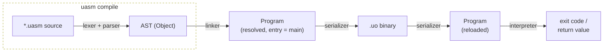
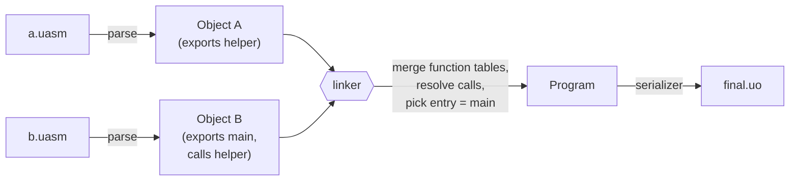

<div align="center">

# uASM

**uAssembly** — a small virtual instruction set, with its own compiler, linker, and VM.

[](LICENSE)
[](spec/ISA.md)
[](CMakeLists.txt)
[](CMakeLists.txt)
[](CMakeLists.txt)

</div>

---

## Table of contents

- [What is uASM?](#what-is-uasm)
- [How it fits together](#how-it-fits-together)
- [Features](#features)
- [Quick start](#quick-start)
- [CLI reference](#cli-reference)
- [Instruction set](#instruction-set)
- [Project layout](#project-layout)
- [Embedding libuasm](#embedding-libuasm)
- [Platform support](#platform-support)
- [Language standard](#language-standard)
- [Versioning](#versioning)
- [License](#license)

---

## What is uASM?

uASM — also spelled out as **uAssembly** — is a small virtual instruction
set architecture (ISA) with a real toolchain behind it, not just a spec on
paper. It comes with:

- a text assembly language (`.uasm`) with a small, regular grammar;
- a **compiler** that turns one or more `.uasm` files into linked **objects**;
- a **linker** that merges those objects, resolving cross-file `call`s, into
  a single program;
- a compact **binary format** (`.uo`) that program serializes to and loads
  from;
- a **bytecode interpreter** (the VM) that runs a `.uo` file directly;
- a **disassembler** that renders a `.uo` file back to readable `uasm`,
  `json`, or `yaml`.

The design leans toward *simplicity over realism*: instead of a fixed
hardware-like register file that a compiler backend would need to
allocate, uASM registers are virtual and unlimited — `r0`, `r1`, `r2`, ...
— so every instruction can just write a fresh one. That single decision is
what lets the whole toolchain (parser → linker → interpreter) stay small:
there's no register-allocation pass, no spilling, no live-range analysis.
It costs realism (this isn't how physical CPUs work) but buys back a
codebase where each stage is short enough to read in one sitting.

uASM is versioned deliberately: `v0.0` through `v1.0` are considered the
**core** language and are free to change shape release to release; once
`v1.0` ships, the core is expected to hold still and new capability arrives
as **extensions** layered on top rather than more changes to the core
semantics. See [Versioning](#versioning) for the full rationale.

## How it fits together

Compiling and running a program moves through five distinct stages, each
implemented in its own part of [`libuasm`](#project-layout):



Compiling **multiple** files works the same way, just with more than one
Object flowing into the linker — this is how cross-file `call`s get
resolved:



Once you have a `.uo` file, `uasm run` and `uasm dump` both start from the
same `readUo()` deserialization step — `run` feeds the result into the
interpreter, `dump` feeds it into the disassembler. Neither needs the
original `.uasm` source; the binary is fully self-describing (it even
carries back the original `module` names — see
[`spec/ISA.md` §7](spec/ISA.md#7-uo-binary-file-format)).

## Features

- **Virtual, unlimited registers.** `r0`, `r1`, `r2`, ... — no fixed
  register file, no allocator. Each function call gets its own private
  register file, growable on demand.
- **Named parameter access.** `$name` is sugar, resolved at parse time,
  for the register a declared parameter is bound to — `func f(a: i32, b:
  i32)` makes `$a`/`r0` and `$b`/`r1` interchangeable.
- **13 value types**, selected per-instruction via a `.T` suffix rather
  than a type system baked into the register file: `i8 u8 i16 u16 i32 u32
  i64 u64 i128 u128 f32 f64 ptr` (plus `void` for return types only).
  `add.i32`, `mov.f64`, `shl.u64` are all the same opcode operating on a
  different type.
- **A real compile → link → run pipeline.** Multiple `.uasm` files compile
  to objects and link into one `.uo` binary, with actual cross-file `call`
  resolution and duplicate-export/unresolved-symbol errors — not a toy
  single-file-only story.
- **Two separate memory regions.** `load`/`store` (plus `alloc`/`free`/
  `realloc`/`memcpy`/`memset`/`memmove`/`memcmp`) address a flat byte heap;
  `push`/`pop` address a distinct, VM-wide call-stack-like region.
- **Extended math and bit manipulation.** `sqrt`/`sin`/`cos`/`log`/`pow`/...
  and `popcount`/`clz`/`ctz`/`bswap`/`rotl`/`rotr`/... round out the core
  instruction set beyond basic arithmetic — see [Instruction set](#instruction-set).
- **Numeric conversion vs. bit reinterpretation, as two different
  instructions.** `convert.i32 rD, rS` truncates/extends a value's *meaning*
  (`f64` `4.0` → `i32` `4`); `cast.u32 rD, rS` reinterprets its *bits*
  unchanged (an `f32` holding `1.0` casts to the `u32` `1065353216`, its
  IEEE-754 bit pattern). Conflating these two is a classic source of bugs
  in other small VMs, so uASM keeps them as separate, unambiguous
  mnemonics.
- **Introspectable, not a black box.** `uasm dump` renders any `.uo` file
  back to readable `uasm` text, `json`, or `yaml` — useful for debugging
  the compiler itself, or for tooling built on top of `libuasm`.
- **Glob-aware compilation.** `uasm compile examples/*.uasm` and `uasm
  compile "examples/**.uasm"` both work, with `*` deliberately scoped to
  one directory and `**` recursing — see [CLI reference](#cli-reference).
- **A real library, not just a CLI.** Everything the CLI does is exposed
  through `libuasm`'s public headers, so you can lex/parse/link/run/
  disassemble uASM programs from your own C++ code — see
  [Embedding libuasm](#embedding-libuasm).
- **Builds from `-std=c++03` through C++20**, picking up nicer standard
  library facilities automatically on newer standards without requiring
  them — see [Language standard](#language-standard).
- **macOS, Linux, and Windows (MinGW-w64)**, with platform-specific code
  isolated into its own file per platform rather than scattered `#ifdef`s
  — see [Platform support](#platform-support).

## Quick start

```bash
cmake -B build
cmake --build build

# compile one or more files (globs supported: `*` per-folder, `**` recursive)
./build/uasm compile examples/basics.uasm -o basics.uo

# run it, passing typed arguments to functions that take them
./build/uasm run basics.uo -- i32:40 i32:2

# inspect a compiled binary
./build/uasm dump basics.uo
./build/uasm dump -f json basics.uo
./build/uasm dump -f yaml basics.uo
```

Building produces two targets: `libuasm` (the reusable compiler/linker/VM
library) and `uasm` (the CLI built on top of it). Install both, plus the
public headers, under the standard system locations (`bin`, `lib`,
`include`):

```bash
cmake -B build -DCMAKE_INSTALL_PREFIX=/usr/local
cmake --build build
cmake --install build
```

See [`examples/`](examples/) for three annotated programs covering
parameters, arithmetic, control flow, the VM stack, the flat heap, and
bitwise/conversion instructions.

## CLI reference

### `uasm compile <files...> -o <out.uo>`

Parses each input into an object, links every object together (resolving
cross-file `call`s, picking the exported `main` as the entry point), and
writes the result as a single `.uo` binary.

```bash
uasm compile a.uasm b.uasm -o out.uo   # explicit file list
uasm compile "src/*.uasm" -o out.uo    # everything directly in src/
uasm compile "src/**.uasm" -o out.uo   # everything under src/, recursively
```

`*` matches any run of characters **within one path segment** — it will
not cross a `/`. `**` matches across directory boundaries. Both forms
filter to files ending in `.uasm`, sort matches for a deterministic build
order, and error out if a pattern matches nothing. Quote glob patterns so
your shell doesn't expand them first if you specifically want `**`
recursion (most shells don't understand `**` on their own).

### `uasm run <file.uo> [-j|--jit [n]] [-- <type>:<value> ...]`

Loads a `.uo` file and runs it, starting at its entry function. Arguments
after `--` are positional, each written as `type:value`:

```bash
uasm run out.uo                          # no-argument entry function
uasm run out.uo -- i32:10 i32:32         # two i32 arguments
uasm run out.uo -- f64:3.14 ptr:0        # mixed types
uasm run out.uo -j -- i32:10 i32:32      # JIT-compiled, 1 thread
uasm run out.uo -j 4 -- i32:10 i32:32    # JIT-compiled, 4 threads
```

Without `-j`/`--jit`, this uses the bytecode interpreter (unchanged
behavior). With it, the program is compiled ahead-of-time to native code
for the *host* machine — across `n` worker threads if given, `1` if not —
then executed directly in memory; there's no interpreter fallback and no
profiling/tiered recompilation. As of v0.4 this only works when the host
is `macos-arm64` and the program uses only the instruction subset the
native backend supports (see [`spec/ISA.md` §11](spec/ISA.md#11-native-code-generation-and-jit))
— anything else reports a clear error rather than silently falling back.

The process exit code is the entry function's return value truncated to
an `i32` (matching typical POSIX exit-code conventions); non-`i32` return
types currently exit `0`.

### `uasm dump [-f|--format uasm|json|yaml] <file.uo>`

Renders a `.uo` file back to readable text, without needing the original
`.uasm` source — the binary carries function names, parameter types,
per-function `module` names, and every instruction. Defaults to `uasm`
(reconstructed uasm-like source); `json` and `yaml` give a fully
structured view, useful for tooling.

### `uasm build <file.uo> --<target> -o <output>`

Compiles a `.uo` file ahead-of-time into a standalone native executable —
no `libuasm`, no libc, no dynamic linker at runtime. As of v0.4, only
`--macos-arm64` is implemented; the other nine `{arch}-{os}` target flags
(`--macos-x86_64`, `--windows-x86`, `--windows-x86_64`, `--windows-arm32`,
`--windows-arm64`, `--linux-x86`, `--linux-x86_64`, `--linux-arm32`,
`--linux-arm64`) parse but report "no native codegen backend ... yet"
rather than silently producing something broken.

```bash
uasm build out.uo --macos-arm64 -o out_native
```

Only a subset of the instruction set is supported by the native backend
(integer `mov`/`add`/`sub`/`mul`/`div`/`cmp`/branches/`call`/`ret`) — see
[`spec/ISA.md` §11](spec/ISA.md#11-native-code-generation-and-jit), which
also covers a known limitation: unsigned `macos-arm64` output currently
can't execute on real Apple Silicon hardware (the kernel requires at least
an ad-hoc code signature, and `uasm build` deliberately never shells out to
`codesign` or any other external tool).

## Instruction set

The full instruction set, grammar, and `.uo` binary format are specified in
[`spec/ISA.md`](spec/ISA.md) — this is just the summary, grouped by what
each category is for:

| Category               | Instructions | What it's for |
|-------------------------|--------------|----------------|
| Data movement           | `mov` | Raw, non-converting copy between a register and an immediate or another register. |
| Arithmetic              | `add` `sub` `mul` `div` `mod` `neg` | Standard signed/unsigned integer and float arithmetic. |
| Bitwise & shifts        | `and` `or` `xor` `not` `shl` `shr` | Integer-only bit manipulation; undefined on float types. |
| Type conversion         | `convert` `cast` | Numeric conversion vs. raw bit reinterpretation — see [Features](#features). |
| Comparison & branching  | `cmp` `beq` `bne` `blt` `bgt` `ble` `bge` `jmp` | `cmp` sets a flag register; the six conditional branches and `jmp` read it. |
| Calls & returns         | `call` `ret` | Calling another function (same or different source file) and returning a value. |
| Flat heap memory        | `load` `store` `alloc` `free` `realloc` `memcpy` `memset` `memmove` `memcmp` | Byte-addressed access, plus a first-fit allocator, over a fixed-size memory region shared by the whole run. |
| VM stack                | `push` `pop` | A separate, call-stack-like region, distinct from the heap. |
| Extended math           | `sqrt` `cbrt` `floor` `ceil` `round` `trunc` `abs` `min` `max` `pow` `fma` `sin` `cos` `tan` `asin` `acos` `atan` `atan2` `sinh` `cosh` `tanh` `log` `log2` `log10` `exp` `exp2` `hypot` `copysign` `fmod` | Trig/log/exp/rounding beyond basic arithmetic; float-only except `abs`/`min`/`max`. |
| Bit manipulation        | `popcount` `clz` `ctz` `bswap` `rotl` `rotr` `bitset` `bitclear` `bittest` `parity` `ffs` `bitreverse` | Integer-only bit-level operations. |
| Syscalls                | `syscall` | Calls one of 60 platform-neutral "universal" OS operations (file I/O, sockets, time, env, ...) — see [`spec/ISA.md` §12](spec/ISA.md#12-syscalls). |

## Project layout

```
include/uasm/               public library headers — the embeddable API surface
src/core/                   Type/Value fundamentals shared by every other stage
src/frontend/               lexer + parser: .uasm text -> AST
src/linker/                 merges N compiled objects into one resolved Program
src/vm/interpreter.cpp      the bytecode interpreter that runs a Program
src/vm/jit.cpp              `uasm run -j`: parallel ahead-of-time compile to host native code + execute in memory
src/vm/syscall.cpp          `syscall` opcode: shared process-args storage, dispatches to a platform backend
src/vm/posix/syscall.cpp    all 60 universal syscall IDs via real Linux/macOS libc + syscalls
src/vm/windows/syscall.cpp  all 60 universal syscall IDs via real Win32 APIs
src/format/                 .uo binary read/write, plus the uasm/json/yaml disassembler
src/util/glob.cpp           platform-agnostic glob logic (pattern matching, sorting)
src/util/glob_platform.h    the three functions each platform backend below implements
src/util/generic/glob.cpp   backend for C++17+ (std::filesystem, any OS)
src/util/posix/glob.cpp     backend for macOS/Linux/MinGW pre-C++17 (dirent.h)
src/util/windows/glob.cpp   backend for MSVC pre-C++17 (WinAPI FindFirstFile)
src/util/posix/jit_memory.cpp    mmap/mprotect-backed executable memory for JIT
src/util/windows/jit_memory.cpp  VirtualAlloc/VirtualProtect-backed equivalent
src/codegen/codegen.cpp     `uasm build`: target-agnostic driver (register slots, branch/call fixups, linking)
src/codegen/arm64/          AArch64 instruction encoder (only arch implemented as of v0.4)
src/codegen/macos/          minimal Mach-O executable writer (only OS implemented as of v0.4)
src/cli/                    the `uasm` command-line tool, built on top of libuasm
spec/ISA.md                 the language / ISA / file-format specification
examples/                   four annotated sample .uasm programs
```

Only one of the three platform backends above actually contributes code
in any given build — each guards its entire contents with a preprocessor
check on the C++ standard and target OS, so all three can always be listed
as sources without ever colliding. Platform-specific code for a module
lives in its own subfolder (`generic/`, `posix/`, `windows/`, and so on as
more platforms are added) rather than `#ifdef`-interleaved through one
shared file or disambiguated only by filename suffix — see
[Platform support](#platform-support).

## Embedding libuasm

Everything the CLI does is just a thin wrapper over `libuasm`'s public
headers — parsing, linking, serializing, and interpreting are all
available to your own C++ code:

```cpp
#include "uasm/parser.h"
#include "uasm/linker.h"
#include "uasm/interpreter.h"

uasm::Object obj = uasm::parseModule(sourceText, "in-memory.uasm");

std::vector<uasm::Object> objects;
objects.push_back(obj);
uasm::Program program = uasm::link(objects);

std::vector<uasm::Value> args;
args.push_back(uasm::Value::fromInt128(uasm::Type::I32, 40));
args.push_back(uasm::Value::fromInt128(uasm::Type::I32, 2));

uasm::Value result = uasm::run(program, args);
```

Every stage throws a plain-struct exception on failure (`ParseError`,
`LinkError`, `SerializeError`, `RuntimeError`, ...), each carrying a
`message` and — where relevant — a `line` number, so embedding code can
report errors without parsing strings.

## Platform support

macOS and Linux are supported on any C++03–C++20-capable compiler
(GCC/Clang). Windows is supported through **MinGW-w64** (GCC or Clang
targeting the MinGW runtime) or through a C++17-or-newer compiler on any
toolchain, including MSVC — with one caveat:

> **MSVC pre-C++17 note.** uASM's `i128`/`u128` types are backed by
> `__int128`, a GCC/Clang compiler extension with no MSVC equivalent
> (MSVC has no native 128-bit integer type at any `/std:` level). Building
> with real MSVC therefore needs Clang-cl or a C++17+ configuration where
> this stops mattering for everything *except* `i128`/`u128` themselves;
> a pure-MSVC, pre-C++17 build is not supported today. MinGW-w64 has no
> such restriction — its GCC/Clang front end provides `__int128` the same
> way it does on Linux, and its runtime provides `dirent.h`, so Windows
> builds under MinGW take the exact same code path as macOS/Linux (see
> [`src/util/posix/glob.cpp`](src/util/posix/glob.cpp)).

`uasm compile`'s glob patterns and the CLI's argument handling are
otherwise platform-neutral — paths are matched and joined with `/`
throughout, which every supported Windows toolchain (MinGW and native
WinAPI alike) accepts interchangeably with `\`.

## Language standard

The codebase is written to build under `-std=c++03`, but automatically
picks up nicer behavior — `unordered_map`, `std::filesystem`-based glob
expansion, move semantics — when compiled against a newer standard. It
defaults to C++17. To build in strict C++03 mode instead (falls back to
`std::map` and a POSIX `dirent.h`-based glob):

```bash
cmake -B build -DCMAKE_CXX_STANDARD=98 -DCMAKE_CXX_EXTENSIONS=OFF
```

(CMake's `CXX_STANDARD` only recognizes `98`/`11`/`14`/`17`/`20`/`23` — `98`
is the closest match to actual C++03 and shares the same pre-C++11
`__cplusplus` value that this codebase's feature checks look at.) Both
build modes are exercised directly — not just assumed — before every
change lands: a strict-C++98 build with GNU extensions disabled and
`-pedantic -Wall -Wextra`, plus builds at every standard from C++03 through
C++20, all running the full example suite.

## Versioning

`v0.0`–`v1.0` are the **core** versions — the instruction set, type system,
and file format evolving in place, with no compatibility promise between
minor versions yet. `v1.0` is when the core is considered stable; new
capabilities after that land as **extensions** on top of the frozen core
rather than by continuing to change it. The `.uo` magic's `!0` suffix is a
file-*type* tag (distinguishing a `.uo` from a future `.ulib` or similar),
not a version counter — see
[`spec/ISA.md` §8](spec/ISA.md#8-uo-binary-file-format) for the exact
format this describes.

## License

[MIT](LICENSE)
