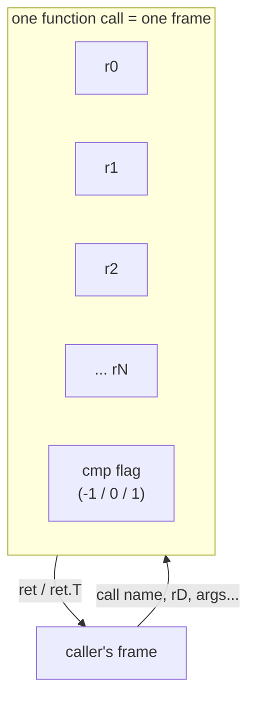
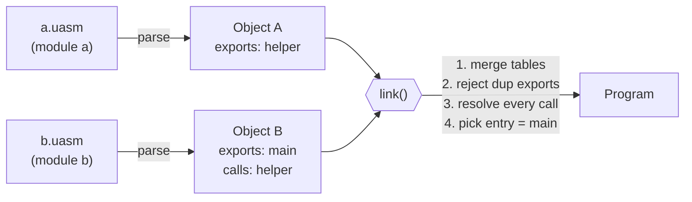

<div align="center">

# uASM

### Instruction Set & File Format Specification

[](../README.md#versioning)
[](#8-uo-binary-file-format)
[](../LICENSE)

*aka "uAssembly" — see [README.md](../README.md) for the toolchain itself.*

</div>

---

### Contents

1. [Types](#1-types)
2. [Register model](#2-register-model)
3. [Value representation](#3-value-representation)
4. [Instruction set](#4-instruction-set-v04)
5. [Module / text grammar](#5-module--text-grammar-ebnf)
6. [Worked example: source to result](#6-worked-example-source-to-result)
7. [Object / link model](#7-object--link-model)
8. [`.uo` binary file format](#8-uo-binary-file-format)
9. [Error handling](#9-error-handling)
10. [Example programs](#10-example-programs)
11. [Native code generation and JIT](#11-native-code-generation-and-jit)
12. [Syscalls](#12-syscalls)

---

## 1. Types

uASM has 13 value types plus `void`. There is deliberately no notion of a
user-defined type, struct, or array at the core level — those, if they
ever arrive, are extension-era material (see
[Versioning](../README.md#versioning) in the README). Every
type below is fixed-size and known to the interpreter natively.

<div align="center">

| Type   | Meaning                                          | Size (bytes) |
|:------:|---------------------------------------------------|:---:|
| `i8`   | signed 8-bit integer                              | 1 |
| `u8`   | unsigned 8-bit integer                            | 1 |
| `i16`  | signed 16-bit integer                             | 2 |
| `u16`  | unsigned 16-bit integer                           | 2 |
| `i32`  | signed 32-bit integer                             | 4 |
| `u32`  | unsigned 32-bit integer                           | 4 |
| `i64`  | signed 64-bit integer                             | 8 |
| `u64`  | unsigned 64-bit integer                           | 8 |
| `i128` | signed 128-bit integer                            | 16 |
| `u128` | unsigned 128-bit integer                          | 16 |
| `f32`  | IEEE-754 single precision float                   | 4 |
| `f64`  | IEEE-754 double precision float                   | 8 |
| `ptr`  | opaque, address-sized value                       | 8 |
| `void` | no value — only valid as a function return type   | 0 |

</div>

A type is never declared on its own — it only ever appears as a function
parameter/return type, or as the `.T` suffix on an instruction (see
[§4](#4-instruction-set-v04)). There's no separate `typedef`-like
mechanism; if you need the same shape twice, write the suffix twice.

`ptr` is deliberately opaque: it's just an address-sized integer with no
arithmetic type rules of its own beyond what `load`/`store` and `push`/
`pop` do with it (see [§4](#4-instruction-set-v04)). It exists so that
"this is an address" is visible in the instruction stream, rather than
overloading `u64` for two different jobs.

---

## 2. Register model

Registers are virtual and unlimited per function: `r0`, `r1`, `r2`, ...
Every instruction that writes a register may write a fresh one — the
model is intentionally SSA-*like* (nothing stops a program from writing
the same register twice, but nothing requires it either). There is no
fixed register file to allocate ahead of time, and no declaration step:
a register comes into existence the moment something writes to it.

A register's type is whatever the instruction that wrote it says, via
that instruction's `.T` suffix — the interpreter tracks only *dynamic*
types (what a `Value` currently holds), never *static* ones. Reading a
register that was never explicitly written returns a zero-valued `i32`
(the frame's register file grows on demand and default-constructs to
that); reading one that *was* written returns whatever `Value` it last
held, regardless of which instruction is reading it now. Relying on the
zero-default is not recommended — a future core or extension version may
tighten this into a hard error — but it is well-defined in v0.x.



Each function call gets its **own** register file — a growable array of
`Value`, private to that call's frame — plus its own single-slot compare
flag, set by `cmp` and read by the six conditional branches (see
[§4](#4-instruction-set-v04)). Registers are never shared across calls:
a recursive call to the same function gets a brand-new `r0`, `r1`, ...,
completely independent of the caller's. This is what makes recursion work
correctly with no extra bookkeeping in user code — there's no way to
accidentally clobber a caller's register, because there's no *access* to
a caller's registers at all.

---

## 3. Value representation

A `Value` is a tagged union able to hold any of the 13 non-`void` types
from [§1](#1-types) — conceptually, a type tag plus enough raw storage
for the widest type (`i128`/`u128`, 16 bytes). Instructions are always
explicit about which type they operate on via a `.T` suffix (e.g.
`add.i32`, `mov.f64`); the same opcode name is reused across every type
it makes sense for, rather than having a distinct mnemonic per type (no
`addi32`/`addf64`/`adduq` zoo).

This is also why `mov` and `convert` are different instructions (see
[§4](#4-instruction-set-v04)): a `Value`'s tag can be *changed* — `mov`
deliberately does not do so (it copies the source `Value` verbatim,
carrying its dynamic type along for the ride), while `convert` explicitly
re-tags and reinterprets it numerically.

---

## 4. Instruction set (v0.4)

All arithmetic/data instructions take a type suffix `.T` where `T` is one of
the types in [§1](#1-types) (excluding `void`).

#### Data movement & conversion

| Instruction         | Effect |
|----------------------|--------|
| `mov.T rD, imm`      | `rD := imm` |
| `mov.T rD, rS`       | `rD := rS` (raw copy — see note below) |
| `convert.T rD, rS`   | numeric conversion: `rD := (T) rS` (e.g. `f64` `4.0` → `i32` `4`; truncates floats toward zero, sign/zero-extends or narrows integers) |
| `cast.T rD, rS`      | bitcast: `rD`'s raw bytes become `rS`'s raw bytes reinterpreted as `T` — no numeric conversion (e.g. `cast.u32` on an `f32` holding `1.0` gives `1065353216`, its IEEE-754 bit pattern, not `1`); truncates high bytes if `T` is narrower than `rS`'s type, zero-fills if wider |

> **Note** — `mov.T rD, rS` never converts: it copies `rS`'s value into `rD`
> as-is, whatever dynamic type `rS` currently holds. Use `convert` to change
> a value's type while preserving its numeric meaning, and `cast` to
> reinterpret its bits unchanged.

```uasm
mov.f32 r0, 1.0        ; r0 = 1.0f
cast.u32 r1, r0        ; r1 = 1065353216   (raw IEEE-754 bits of 1.0f)
convert.u32 r2, r0     ; r2 = 1            (numeric value of 1.0f)
```

#### Arithmetic

| Instruction              | Effect |
|----------------------------|--------|
| `add.T rD, rA, rB`         | `rD := rA + rB` |
| `sub.T rD, rA, rB`         | `rD := rA - rB` |
| `mul.T rD, rA, rB`         | `rD := rA * rB` |
| `div.T rD, rA, rB`         | `rD := rA / rB` |
| `mod.T rD, rA, rB`         | `rD := rA % rB` (integer types only; error on `rB == 0`) |
| `neg.T rD, rA`             | `rD := -rA` |

`div`/`mod` by zero, on any type, is a runtime error rather than a
silently-produced infinity/NaN or trap — uASM v0.x has no floating-point
exception model, so it treats division-by-zero uniformly regardless of
`T`.

#### Bitwise & shifts

| Instruction              | Effect |
|----------------------------|--------|
| `and.T rD, rA, rB`         | `rD := rA & rB` (bitwise AND; integer types only) |
| `or.T rD, rA, rB`          | `rD := rA \| rB` (bitwise OR; integer types only) |
| `xor.T rD, rA, rB`         | `rD := rA ^ rB` (bitwise XOR; integer types only) |
| `not.T rD, rA`             | `rD := ~rA` (bitwise complement; integer types only) |
| `shl.T rD, rA, rB`         | `rD := rA << rB` (integer types only; `rB` must be `[0, bit-width)`) |
| `shr.T rD, rA, rB`         | `rD := rA >> rB` (arithmetic for signed `i*`, logical for unsigned `u*`/`ptr`; integer types only) |

> **Note** — bitwise and shift instructions are undefined on `f32`/`f64` and
> raise a runtime error if used with a float type suffix. A `shl`/`shr`
> shift amount outside `[0, bit-width)` for `T` is likewise a runtime
> error rather than a silently-masked shift.

```uasm
mov.u8 r0, 0xF0        ; (decimal 240)
mov.u8 r1, 0x0F        ; (decimal 15)
and.u8 r2, r0, r1      ; r2 = 0
or.u8  r3, r0, r1      ; r3 = 255
xor.u8 r4, r0, r1      ; r4 = 255
not.u8 r5, r1          ; r5 = 240
```

#### Comparison & control flow

| Instruction                | Effect |
|------------------------------|--------|
| `cmp.T rA, rB`                | sets the frame's flag register: `-1`/`0`/`1` for `<`/`==`/`>` |
| `beq label` / `bne label`     | branch to block `label` if the last `cmp` was `==` / `!=` |
| `blt label` / `bgt label`     | branch to block `label` if the last `cmp` was `<` / `>` |
| `ble label` / `bge label`     | branch to block `label` if the last `cmp` was `<=` / `>=` |
| `jmp label`                   | unconditional branch to block `label` |

> **Note** — blocks never fall through implicitly: every block must end
> with a `ret`, `ret.T`, `jmp`, or a conditional branch that is guaranteed
> to be followed (in source) by a `jmp`/`ret` on the not-taken path — the
> interpreter raises a runtime error if execution reaches the end of a
> block's instruction list without having branched or returned. This is a
> deliberate strictness: it turns "I forgot the else branch" into an
> immediate, obvious runtime error instead of undefined fallthrough
> behavior.

```uasm
entry:
    cmp.i32 $a, $b
    blt less
    mov.i32 r2, 0
    jmp done
less:
    mov.i32 r2, 1
    jmp done
done:
    ret.i32 r2
```

#### Calls

| Instruction                       | Effect |
|-------------------------------------|--------|
| `call name, rD, arg0, arg1...`      | calls function `name` (exported or not, as long as it's in the same link) with the given register values as arguments, stores the return value in `rD` |
| `ret.T rS`                          | returns from the current function with `rS`'s value |
| `ret`                                | returns from a `void` function |

`call` can name a function `export`ed from a *different* source file — see
[§7](#7-object--link-model) for how that resolution happens at link time.
Arguments are passed positionally by register value, not by name; a
called function reads them back via `$paramName` or the equivalent
`r0`/`r1`/... (see [§5](#5-module--text-grammar-ebnf)).

#### Memory — flat heap

| Instruction         | Effect |
|-----------------------|--------|
| `load.T rD, rS`       | `rD := *rS` (`rS` holds a `ptr`) |
| `store.T rD, rS`      | `*rD := rS` (`rD` holds a `ptr`) |

`load`/`store` address a fixed-size (1 MiB in the reference interpreter) flat
byte memory shared by the whole run, addressed by byte offset. A program may
still construct an address directly (e.g. `mov.ptr rD, 100`) — `load`/`store`
don't require going through the allocator below — but doing so risks
overlapping a live allocation, since the allocator has no way to know that
range is "in use."

#### Memory — heap allocator

| Instruction                  | Effect |
|--------------------------------|--------|
| `alloc.T dest, size`            | allocates `size` bytes, returns a `ptr` in `dest` |
| `free.ptr src`                  | releases the allocation at `src` |
| `realloc.T dest, ptr, size`     | resizes the allocation at `ptr` to `size` bytes, returns the (possibly new) `ptr` in `dest` |
| `memcpy.T dst, src, len`        | copies `len` bytes from `src` to `dst` (regions must not overlap) |
| `memmove.T dst, src, len`       | copies `len` bytes from `src` to `dst`, safe if the regions overlap |
| `memset.T dst, value, len`      | fills `len` bytes at `dst` with the low byte of `value` |
| `memcmp.T dest, a, b, len`      | compares `len` bytes at `a` and `b`; `dest` gets `<0`/`0`/`>0` like `memcmp(3)` |

`dst`/`src`/`ptr`/`a`/`b` are always `ptr` values; `size`/`len`/`value` are
read as type `T`. The allocator is a first-fit free-list carved out of the
same flat heap `load`/`store` address — deliberately simple (correct, not
fast, no coalescing of adjacent freed blocks); a real allocator design is
future work, not a v0.4 concern. `free`/`realloc`/the `mem*` family on an
address the allocator didn't hand out (or already freed) is a runtime error.

#### Memory — VM stack

| Instruction    | Effect |
|------------------|--------|
| `push.T rS`      | pushes `rS`'s value onto the VM stack |
| `pop.T rD`       | pops the top value (as type `T`) off the VM stack into `rD` |

`push`/`pop` address a separate, fixed-size (64 KiB in the reference
interpreter) VM-wide stack, distinct from the `load`/`store` heap. It is
shared across every call/frame in a run (like a native call stack) rather
than being per-function; overflow/underflow is a runtime error. This
region exists specifically so a program has *somewhere* to spill a value
temporarily without needing a heap address — it is not used implicitly by
`call`/`ret` (arguments and return values travel through registers, not
this stack).

#### Extended math

All of these are float-only (`f32`/`f64`) except `abs`, `min`, and `max`,
which also work on integer types — using any other instruction here with an
integer type suffix is a runtime error.

| Instruction                     | Effect |
|-----------------------------------|--------|
| `sqrt.T dest, a`                   | `dest := sqrt(a)` |
| `cbrt.T dest, a`                   | `dest := cbrt(a)` |
| `floor.T dest, a` / `ceil.T dest, a` / `round.T dest, a` / `trunc.T dest, a` | standard rounding modes |
| `abs.T dest, a`                    | `dest := \|a\|` (int or float) |
| `min.T dest, a, b` / `max.T dest, a, b` | `dest := min/max(a, b)` (int or float) |
| `pow.T dest, a, b`                 | `dest := a ** b` |
| `fma.T dest, a, b, c`              | `dest := a * b + c`, computed in one step |
| `sin`/`cos`/`tan`/`asin`/`acos`/`atan`/`sinh`/`cosh`/`tanh`.T dest, a | standard trig/hyperbolic functions |
| `atan2.T dest, y, x`                | two-argument arctangent |
| `log.T dest, a` / `log2.T dest, a` / `log10.T dest, a` | natural/base-2/base-10 logarithm |
| `exp.T dest, a` / `exp2.T dest, a` | `e^a` / `2^a` |
| `hypot.T dest, a, b`                | `sqrt(a*a + b*b)`, without intermediate overflow |
| `copysign.T dest, a, b`             | magnitude of `a`, sign of `b` |
| `fmod.T dest, a, b`                 | floating-point remainder of `a / b` |

The interpreter implements these with the host's own `<cmath>` (full
precision, matching whatever the host's C library provides). A future native
code-generation backend that can't call into libm may need its own
approximations here — see the README's Versioning section for how such
backend-specific tradeoffs get tracked.

#### Bit manipulation

Integer-only — using any of these with a float type suffix is a runtime
error, mirroring `and`/`or`/`xor`/`not`/`shl`/`shr`.

| Instruction                  | Effect |
|---------------------------------|--------|
| `popcount.T dest, a`             | number of set bits in `a` |
| `clz.T dest, a` / `ctz.T dest, a` | count of leading/trailing zero bits, within `T`'s width |
| `bswap.T dest, a`                | reverses the byte order of `a` |
| `rotl.T dest, a, n` / `rotr.T dest, a, n` | rotates `a` left/right by `n` bits (`n` must be `[0, bit-width)`) |
| `bitset.T dest, a, n`            | `dest := a` with bit `n` set |
| `bitclear.T dest, a, n`          | `dest := a` with bit `n` cleared |
| `bittest.T dest, a, n`           | `dest := 1` if bit `n` of `a` is set, else `0` |
| `parity.T dest, a`               | `1` if `a` has an odd number of set bits, else `0` |
| `ffs.T dest, a`                  | 1-based index of the lowest set bit in `a`, or `0` if `a` is zero |
| `bitreverse.T dest, a`           | reverses the bit order of `a` within `T`'s width |

All of these operate on exactly `T`'s bit width (via `sizeOfType`), not on
the wider internal representation used for arithmetic — e.g. `popcount.i8`
only ever looks at 8 bits, even though a `Value` can hold up to 128.

---

## 5. Module / text grammar (EBNF)

```ebnf
program      := module_decl , { function } ;
module_decl  := "module" , identifier ;

function     := [ "export" ] , "func" , identifier , "(" , [ param_list ] , ")" ,
                 "->" , type , "{" , { block } , "}" ;
param_list   := param , { "," , param } ;
param        := identifier , ":" , type ;

block        := identifier , ":" , { instruction } ;
instruction  := mnemonic , [ operand , { "," , operand } ] , [ comment ] ;
operand      := register | param_ref | immediate | identifier ;
register     := "r" , digit , { digit } ;
param_ref    := "$" , identifier ;
immediate    := [ "-" ] , digit , { digit } , [ "." , digit , { digit } ] ;
comment      := ";" , { any_char_to_eol } ;

type         := "i8" | "u8" | "i16" | "u16" | "i32" | "u32"
              | "i64" | "u64" | "i128" | "u128" | "f32" | "f64"
              | "void" | "ptr" ;
```

Comments start with `;` and run to end of line. Whitespace (including
newlines) is insignificant outside of tokens.

> **`$name` — parameter references.** Sugar for the register a parameter
> was bound to: inside a function's body, `$name` (where `name` is one of
> that function's declared parameters) is resolved **at parse time** to
> the register holding the `name`-th parameter — i.e. `func f(a: i32, b: i32)`
> makes `$a` and `r0` interchangeable, `$b` and `r1` interchangeable, and
> so on by parameter position. It is a compile error to use `$name` for a
> name that isn't a parameter of the enclosing function. `$name` resolves
> to a plain register operand, so it may be used anywhere a register is
> expected, including as a destination.

A program is always exactly one `module` declaration followed by zero or
more functions — there is no way to split a single module's functions
across multiple `module` lines in the same file, and no way for a file to
contribute functions to more than one module. (Splitting a project across
*files*, each with its own module, is the normal way to organize a larger
program — see [§7](#7-object--link-model).)

---

## 6. Worked example: source to result

To make the pipeline concrete, here is a two-parameter function and what
each stage of [`libuasm`](../README.md#how-it-fits-together) does with it:

```uasm
module basics

export func main(a: i32, b: i32) -> i32 {
entry:
    add.i32 r2, $a, $b
    ret.i32 r2
}
```

1. **Lexing** turns the text into tokens: `module`, `basics`, `export`,
   `func`, `main`, `(`, `a`, `:`, `i32`, `,`, `b`, `:`, `i32`, `)`, `->`,
   `i32`, `{`, `entry`, `:`, `add`, `.`, `i32`, `r2`, `,`, `$a`, `,`, `$b`,
   `ret`, `.`, `i32`, `r2`, `}`.
2. **Parsing** builds one `Function` named `main`, `isExported = true`,
   two `i32` params, one block `entry` with two instructions. `$a`/`$b`
   are resolved immediately to register operands `r0`/`r1` (per
   [§5](#5-module--text-grammar-ebnf)) — nothing downstream ever sees a
   `$name` token.
3. **Linking** (even for this single-file case) builds a one-function
   table, confirms `main` is exported, and picks it as the entry point.
4. **Serializing** writes a `.uo` file: magic `UASM!0`, one function
   entry (name `main`, module `basics`, exported, two `i32` params,
   `i32` return, its two-instruction `entry` block), entry index `0`.
5. **Running** with `uasm run out.uo -- i32:40 i32:2` binds `r0 := 40`,
   `r1 := 2`, executes `add.i32 r2, r0, r1` (`r2 := 42`), then
   `ret.i32 r2` returns `42`, which becomes the process exit code.
6. **Dumping** the same `.uo` (`uasm dump out.uo`) reconstructs source
   text — module name and all — without ever touching the original file:
   parameter names are not preserved by the binary format (see
   [§8](#8-uo-binary-file-format)), so they print as `p0`, `p1`, ... instead
   of `a`, `b`.

---

## 7. Object / link model

Compiling one `.uasm` file produces an **object**: a table of functions
(each a name, parameter types, return type, and its blocks/instructions),
plus a list of which functions are `export`ed. Calls (`call name, ...`) to
functions not defined in the same file are left as **unresolved symbol
references** until link time.



**Linking** N objects together:

1. Merge every object's function table into one program-wide table.
2. It is an error for two objects to `export` the same function name.
3. Every `call` operand must resolve to some function (exported or not) in
   the merged table; an unresolved reference is a link error.
4. The linked program's entry point is the exported function named `main`
   (it is a link error if no such export exists, or if it exists in more
   than one contributing object).

A function does not need to be `export`ed to be *called* from within the
same link — only to be visible as a link-time symbol from a different
object's perspective, or to serve as the program's entry point.
Non-exported "private" helper functions inside one file can freely call
each other by name; `export` is purely about cross-object visibility (and
about being eligible as `main`).

---

## 8. `.uo` binary file format

Bytes 0–5: magic `"UASM!0"` — `!0` identifies this as a `.uo` file (a
different file-type identifier will be used for future formats, e.g.
`.ulib`). This is a type tag, not a version number.

Following the magic, in order:

```
u32               function_count
repeat function_count times:
    u32           name_length
    bytes[name_length]  name (UTF-8, not null-terminated)
    u32           module_name_length
    bytes[module_name_length]  module_name -- the `module` this function was
                                               declared in; recovered on dump
    u8            is_exported (0 or 1)
    u8            param_count
    repeat param_count times:
        u8        param_type_tag
    u8            return_type_tag
    u32           code_offset     -- byte offset into the code section below
    u32           code_length     -- length in bytes of this function's code

u32               entry_function_index   -- index into the function table above

u32               code_section_length
bytes[code_section_length]   code_section  -- all functions' encoded
                                               instructions, concatenated,
                                               each function's bytes located
                                               at [code_offset, code_offset+code_length)
```

Type tags are single bytes, one per type in [§1](#1-types), in the order
listed there (`i8`=0, `u8`=1, ..., `ptr`=13).

Instruction encoding inside the code section (v0.x, fixed-width for
simplicity): `u8 opcode | u8 type_tag | u8 dst_present | u32 dst_reg |
u8 operand_count | operand_count * (u8 operand_kind | u64 operand_bits)`,
where `operand_kind` distinguishes a register index, an immediate value, or
a block-label index (branches encode their target block as an index into a
per-function block-offset table prepended to that function's code — this
table is an implementation detail of the encoder/decoder, not re-specified
byte-for-byte here since it may evolve during implementation).

Two things the format deliberately does **not** preserve:

- **Parameter names.** Only each parameter's *type* and position survive
  serialization — `uasm dump` reconstructs `p0`, `p1`, ... rather than the
  original `a`, `b`. If you need round-trippable parameter names, keep the
  `.uasm` source around; the `.uo` binary is meant to be a compiled
  artifact, not a lossless source-map.
- **Comments and whitespace.** These are discarded at the lexer, long
  before any binary is written — there is no comment-preservation
  mechanism at any stage.

What it *does* preserve is each function's originating `module` name,
which is why a multi-module `.uo` still dumps back out grouped under
distinct `module` headers (see
[§6](#6-worked-example-source-to-result)).

---

## 9. Error handling

Each stage of the toolchain reports failure as a distinct, plain-struct
exception type rather than an error code — useful both for the CLI (which
catches each type separately to print a tailored message) and for
embedding code (see the [README](../README.md#embedding-libuasm)):

| Stage | Exception | Carries |
|-------|-----------|---------|
| Lexing | `LexError` | `message`, `line` |
| Parsing | `ParseError` | `message`, `line` |
| Linking | `LinkError` | `message` |
| Serializing / deserializing | `SerializeError` | `message` |
| Running | `RuntimeError` | `message` |
| Dump format parsing | `UnknownDumpFormat` | (a `std::runtime_error`; `what()`) |
| CLI argument parsing (`type:value`) | `InvalidTypedValue` | (a `std::invalid_argument`; `what()`) |

None of these are recoverable mid-stage — a lex/parse/link/runtime error
aborts that call entirely; there is no partial-result or warning-level
reporting in the core. A `ParseError`/`LexError` line number refers to the
`.uasm` source file being compiled; `RuntimeError` has no line number,
since it's raised against a `.uo` binary that no longer carries source
positions.

---

## 10. Example programs

Five annotated programs exercise the full instruction set breadth
described above; see [`examples/`](../examples/) for the source:

| File | Demonstrates |
|------|--------------|
| [`basics.uasm`](../examples/basics.uasm) | `$param` references, `add`, returning a value |
| [`control-flow.uasm`](../examples/control-flow.uasm) | `cmp`, conditional branches, the no-fallthrough rule |
| [`showcase.uasm`](../examples/showcase.uasm) | the VM stack (`push`/`pop`), the flat heap (`load`/`store`), bitwise ops, `convert` vs. `cast` |
| [`v0.4-features.uasm`](../examples/v0.4-features.uasm) | the heap allocator (`alloc`/`free`), extended math (`sqrt`), bit manipulation (`popcount`) |
| [`syscall-demo.uasm`](../examples/syscall-demo.uasm) | `syscall` — `getpid`, `cpu_count`, `cpu_arch_id` |

## 11. Native code generation and JIT

`uasm build` and `uasm run -j`/`--jit`: two ways to run a `.uo` program
without the bytecode interpreter.

- **`uasm build <file.uo> --<target> -o <output>`** compiles ahead-of-time to
  a real, standalone native executable for a chosen `{arch}-{os}` target,
  with no runtime dependency on `libuasm`, libc, or a dynamic linker — the
  output is a fully self-contained binary.
- **`uasm run <file.uo> -j`/`--jit [n]`** compiles the program to native code
  for the *host* machine, in memory, across `n` worker threads (default `1`
  if no number follows the flag), then executes it directly — no
  interpreter fallback, no profiling, no tiered recompilation. Omitting
  `-j`/`--jit` entirely uses the bytecode interpreter, unchanged.

Both share the same code-generation core, organized the same way as the
platform-specific pieces described in [`README.md`](../README.md#project-layout):
one arch-specific instruction encoder per CPU architecture, one OS-specific
executable-format writer per operating system, composed together for a
given `{arch}-{os}` target. As of v0.4, exactly one combination is
implemented — `macos-arm64` — and it supports a strict subset of the
instruction set: `mov`, `add`/`sub`/`mul`/`div` (signed integers only),
`cmp` and the six conditional branches, `jmp`, `call`/`ret`. Anything
outside that subset (float instructions, `load`/`store`, the memory
allocator, bitwise ops, extended math, bit manipulation) is rejected with a
clear error rather than silently miscompiled. The other nine `{arch}-{os}`
combinations parse as valid flags but report "no native codegen backend
... yet" — they are follow-up work, not silently broken.

Register allocation is deliberately naive: every uASM virtual register gets
a fixed stack-frame slot; there is no real allocator, no spilling logic
beyond "everything is already spilled." This is correct, not fast — a real
register allocator is future work.

**Known limitation — unsigned macOS binaries.** Apple Silicon's kernel
refuses to execute a Mach-O binary with no code signature at all (not even
an ad-hoc one). `uasm build --macos-arm64` produces a structurally correct
executable — verified with `otool -l`/`otool -tv`, which decode the
generated Mach-O headers and disassemble the generated instructions
correctly — but running it directly on real Apple Silicon hardware
currently exits via `SIGKILL` before your program's `main` ever runs. This
is a deliberate scope decision, not a bug to be quietly patched: no
external process is invoked at any point in `uasm build` (including
`codesign`), so this limitation is expected to remain until/unless that
decision changes. `uasm run -j` (JIT) is unaffected, since JIT-compiled
code is mapped directly into the running process's own memory rather than
exec'd as a separate signed binary.

## 12. Syscalls

`syscall.T dest, id, arg0, arg1, arg2` calls into the host OS: `id` selects
a **universal syscall ID** (below) — a single ID number that means the
same thing regardless of which of the three platforms it actually runs
on — `arg0`–`arg2` are its (up to three) arguments, and the result goes
into `dest` as type `T`. Pointer-shaped arguments (paths, buffers) are
`ptr` values addressed into the same flat heap `load`/`store` use.

<div align="center">

| ID | Name | Args | ID | Name | Args |
|---|------|------|---|------|------|
| 0 | `exit` | `code` | 30 | `dir_open` | `pathPtr` |
| 1 | `write` | `fd, ptr, len` | 31 | `dir_read` | `handle, bufPtr, len` |
| 2 | `read` | `fd, ptr, len` | 32 | `dir_close` | `handle` |
| 3 | `open` | `pathPtr, flags, mode` | 33 | `file_is_dir` | `pathPtr` |
| 4 | `close` | `fd` | 34 | `file_mtime` | `pathPtr` |
| 5 | `seek` | `fd, offset, whence` | 35 | `file_perms_get` | `pathPtr` |
| 6 | `file_size` | `fd` | 36 | `file_perms_set` | `pathPtr, mode` |
| 7 | `remove_file` | `pathPtr` | 37 | `copy_file` | `srcPtr, dstPtr` |
| 8 | `rename_file` | `oldPtr, newPtr` | 38 | `disk_free_space` | `pathPtr` |
| 9 | `mkdir` | `pathPtr` | 39 | `get_temp_dir` | `bufPtr, len` |
| 10 | `rmdir` | `pathPtr` | 40 | `get_exe_path` | `bufPtr, len` |
| 11 | `getcwd` | `bufPtr, len` | 41 | `get_hostname` | `bufPtr, len` |
| 12 | `chdir` | `pathPtr` | 42 | `env_count` | — |
| 13 | `file_exists` | `pathPtr` | 43 | `env_get` | `index, bufPtr, len` |
| 14 | `realpath` | `pathPtr, bufPtr, len` | 44 | `term_columns` | — |
| 15 | `time_unix_seconds` | — | 45 | `term_rows` | — |
| 16 | `time_unix_millis` | — | 46 | `file_lock` | `fd` |
| 17 | `tick_count_ms` | — | 47 | `file_unlock` | `fd` |
| 18 | `sleep_millis` | `ms` | 48 | `socket_create` | `domain, type` |
| 19 | `getpid` | — | 49 | `socket_connect` | `sockfd, hostPtr, port` |
| 20 | `cpu_count` | — | 50 | `socket_bind` | `sockfd, hostPtr, port` |
| 21 | `page_size` | — | 51 | `socket_listen` | `sockfd, backlog` |
| 22 | `getenv` | `namePtr, bufPtr, len` | 52 | `socket_accept` | `sockfd` |
| 23 | `setenv` | `namePtr, valuePtr` | 53 | `socket_send` | `sockfd, ptr, len` |
| 24 | `argc` | — | 54 | `socket_recv` | `sockfd, ptr, len` |
| 25 | `argv` | `index, bufPtr, len` | 55 | `socket_close` | `sockfd` |
| 26 | `random_bytes` | `bufPtr, len` | 56 | `dns_resolve` | `hostPtr, bufPtr, len` |
| 27 | `isatty` | `fd` | 57 | `mem_page_alloc` | `size` |
| 28 | `flush` | `fd` | 58 | `mem_page_protect` | `ptr, size, prot` |
| 29 | `stdin_available` | — | 59 | `cpu_arch_id` | — |

</div>

All 60 IDs are deliberately restricted to operations with a real, sane
implementation path on **all three** platforms (raw syscalls or libc on
Linux/macOS, Win32 on Windows) — nothing that only exists on one or two of
them (process spawn, signals, symlinks, thread/mutex creation) made the
list, on purpose.

**Where each ID actually runs:**

- **Interpreter (`uasm run`, no `-j`)** — all 60 IDs, on all three
  platforms, implemented by calling the real host OS APIs directly (this
  is ordinary C++ code, so there's no "no dynamic linking" constraint
  here).
- **JIT (`uasm run -j`) and native `uasm build --macos-arm64`** — only a
  **subset**, and only via a **raw kernel syscall**, since native code has
  no libc to call into: `exit`(0), `read`(2), `write`(1), `open`(3),
  `close`(4), `remove_file`(7), `chdir`(12), `mkdir`(9), `rmdir`(10),
  `getpid`(19), `mem_page_protect`(58), and `cpu_arch_id`(59, which isn't
  a real syscall at all — it's a compile-time constant, since the native
  backend already knows its own target architecture). The syscall `id`
  operand must be a literal immediate for native codegen (not loaded
  through a register) — the specific ID has to be known at compile time
  to pick the right raw syscall number. Any other ID compiles cleanly
  under the interpreter but is rejected with a clear error under `-j`/
  `build`, rather than silently doing the wrong thing.
- **Native `uasm build` for any other target** — rejected entirely, same
  as every other not-yet-implemented opcode on those targets (see
  [§11](#11-native-code-generation-and-jit)).

The raw-syscall numbers used for the native subset above are Darwin's
public BSD syscall numbers, which have been stable across many macOS
versions — but Apple has never committed to them as a supported ABI, so
this is explicitly best-effort, same spirit as the rest of native codegen.

<div align="center">

---

*Part of the [uASM / uAssembly](../README.md) project · [MIT licensed](../LICENSE)*

</div>
